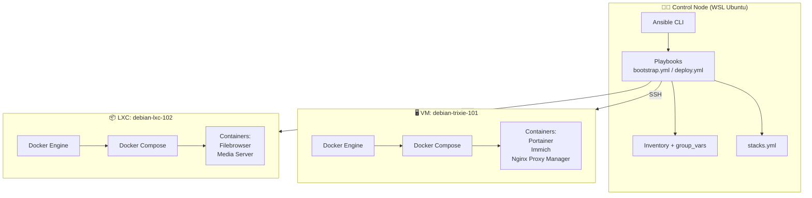
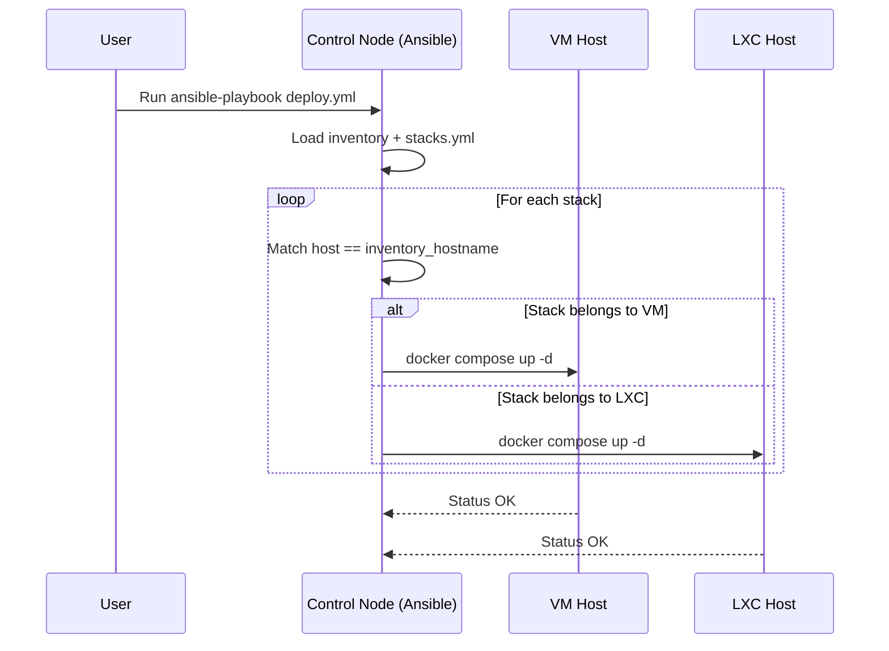
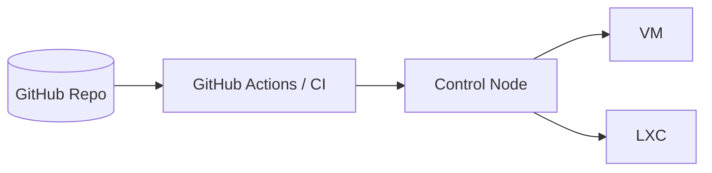

# 🏗️ Homelab Architecture

This diagram shows how the control node (WSL) interacts with VM and LXC hosts using Ansible and deploys Docker-based services.

---

## 📊 System Architecture

---

## 🔁 Deployment Flow

---

## 🧠 Key Concepts

### 🔹 Control Node

* Runs inside WSL (Ubuntu)
* Executes Ansible playbooks
* Holds configuration and stack definitions

---

### 🔹 Inventory-Based Targeting

* Hosts grouped as:

  * `docker_vm`
  * `docker_lxc`
* Controls sudo vs non-sudo behavior

---

### 🔹 Stack Routing (`stacks.yml`)

* Defines where each service runs
* Enables multi-host deployment

---

### 🔹 Idempotent Execution

* Docker installed only if missing
* Services deployed safely on repeat runs

---

### 🔹 SSH-Based Execution

* No agents required
* Secure, key-based authentication

---

## 🚀 Future Architecture (Planned)

* GitOps workflow
* Auto-deploy on commit
* Drift detection

---
