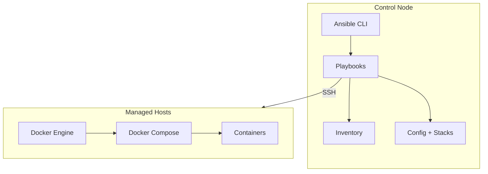
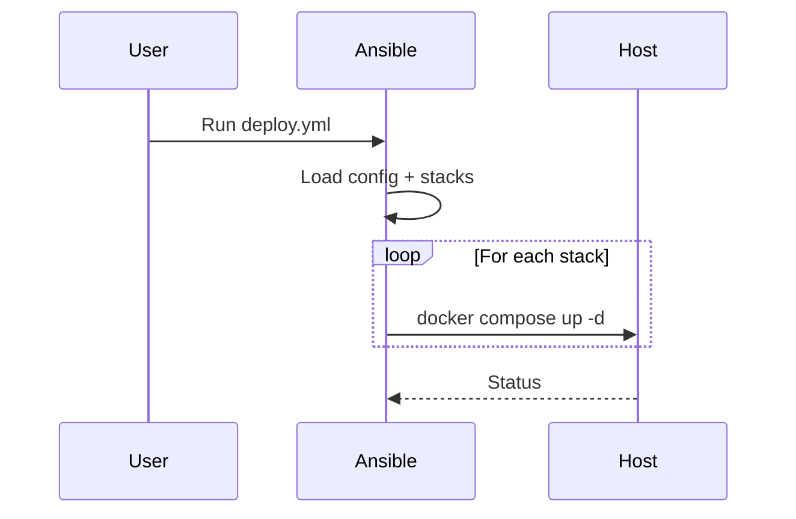

# 🏗️ Architecture

---

## 📊 System Overview

---

## 🔁 Deployment Flow

---

## 🧠 Key Concepts

### Control Node

Runs Ansible and manages deployments.

---

### Hosts

Machines where containers run.

---

### Stack Mapping

Defined per host via config files.

---

### Idempotency

Only changes are applied.

---

### Secrets

Handled separately via Vault.

---

## 🚀 Future Direction

* GitOps automation
* Drift detection
* Monitoring integration

---
